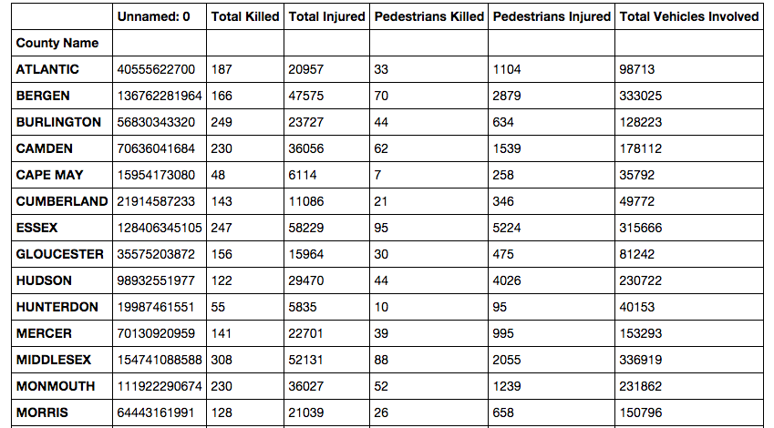

We've done a bit of cleaning to our outrageously messy data, and now we want to start to explore what's actually in this data and look for more spots we have to clean. 

If you were reporting on car accidents in your state, what would you want to know? Some of the questions you'd ask might include:

* How many deaths happened in each county?
* How many accidents have happened over time?
* How many people are involved in car accidents?
* What counties might be outliers in terms of deaths and injuries?

We'll start by reading our data into our DataFrame. Then we'll filter it and do a few group-bys, which should be familiar if you've ever worked with SQL. Finally, we'll create smaller DataFrames of this aggregated data to visualize.

One of the cleaning tasks we'll have to deal with is the format of the 'Crash Date' field, so we might as well import Python's standard `datetime` module now.

```python
from datetime import datetime
newframe = pd.read_csv('smallertab.csv')
```

This should all be pretty familiar. Now, we want to see our data aggregated by counties, so here's where pandas' `groupby()` function comes in.

```python
newframe.groupby('County Name')
```
Now, when we run `.groupby()`, it returns a DataFrameGroupBy object, which is really only good to us if we do something else with it.

So try this:

```python
newframe.groupby('County Name').sum()
```

Let's deconstruct this a bit, because we're chaining a lot together at once here.
We start with our DataFrame object, called `newframe`. We then do `.groupby()`, passing it the name of the column we're aggregating on. As we said, this is reminiscent of SQL and returns the DataFrameGroupBy object.
We can then run `.sum()` on the GroupBy object to add up the numeric columns for each county, returning a new DataFrame, which looks like the kind of Pivot Table we'd make in Excel.



Say we want to know which county had the most people killed in accidents over this time period. We can slice out just the 'Total Killed' column and sort it from most to least.

```python
newframe.groupby('County Name').sum().iloc[:,1].order(ascending=False)
```

We select the 'Total Killed' column here using `.iloc[]`, which wants a two-item list. The first item is a slice of the rows. Since we want all rows, we'll use the standard Python slicing notation of an empty colon. The second item in the list is the columns we want, which is just column 2, or if you're counting from 0, as Python does, column 1.

Finally, the `.order()` function will sort the resulting series and pass it the `ascending` keyword with a value of `False` (it defaults to `True`) to get the largest figures at the top of the list.

We can assign that to a new dataframe variable that we'll use later to make a bar chart and move on for now.

```python
countydeaths = newframe.groupby('County Name').sum().iloc[:,1].order(ascending=False)
```

Now we want to aggregate the accidents by date. But you may have noticed that the dates here are strings and not actual Python date objects. This means when you try to sort them, you get 01/01/2008, 01/01/2009, 01/01/2010, and so on. We need convert the strings to actual Python dates.

```python
newframe['Crash Date']=newframe['Crash Date'].apply(lambda x: datetime.strptime(x, "%m/%d/%Y").date())
```

What did we do here? We take the 'Crash Date' column and use the `.apply()` function to perform some operation across the value in every row in that column. Then we use Python's lambda, a way to write an unnamed, one-line function. If the variable for the date string in each row of the 'Crash Date' column is x, apply and lambda perform the `.strptime()` function from Python's `datetime` module. The part in double quotes `"%m/%d/%Y"` says to take a string that is a two-digit month and a two-digit date and a four-digit year, divided by slashes, and convert it to a datetime object. Finally, `.date()` takes just the date part of that object and returns that into the row. That's a mouthful.

Now that we've done that, we can aggregate the crashes by real, sortable dates and count how many accidents happened on each date. Then we'll assign this to a new variable for the resulting DataFrame that we'll use later to make a line chart. 

```python
crashesbydate = newframe.groupby('Crash Date').count().iloc[:,0]
```

So far we've just been transforming and tweaking data that already exists in our dataframe. We can also calculate new data and add it as a column. Here we can create a column for the total number of people involved in an accident by adding together the 'Total Killed' and 'Total Injured' columns. This syntax works similarly to creating a new key in a Python dict.

```python
newframe['Total Involved']=newframe['Total Killed'] + newframe['Total Injured']
```

With this 'Total Involved' value, we can create a histogram later.

Finally, let's create a DataFrame of all the columns aggregated by county so we can make a scatter plot of the counties by total killed and pedestrians killed.

With this 'Total Involved' value, we can create a histogram later.

```python
newframe['Crash Day Of Week']=newframe['Crash Day Of Week'].map(str.strip)
```

Here, we're using .map() to call the pandas built-in strip method on its string method across the column, which is a Series object.

Finally, let's create a DataFrame of all the columns aggregated by county so we can make a scatter plot of the counties by total killed and pedestrians killed.

```python
countyframe = newframe.groupby('County Name').sum()
```

With these new DataFrames, we have several slices of our data. Let's see what it looks like by visualizing it.